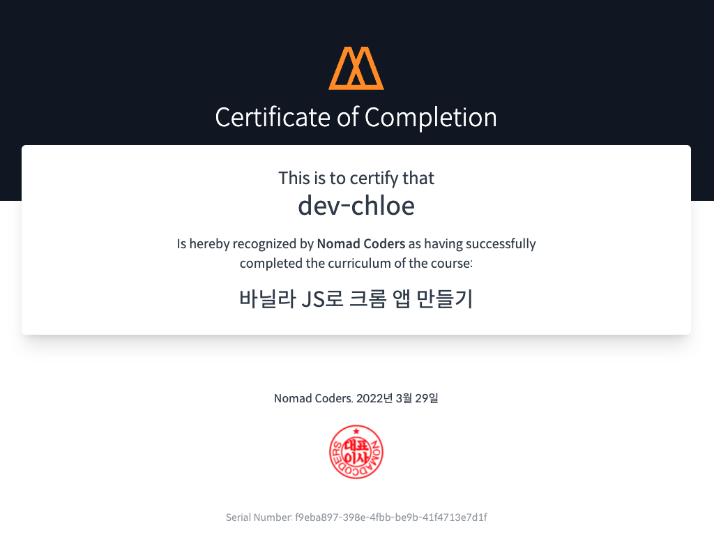
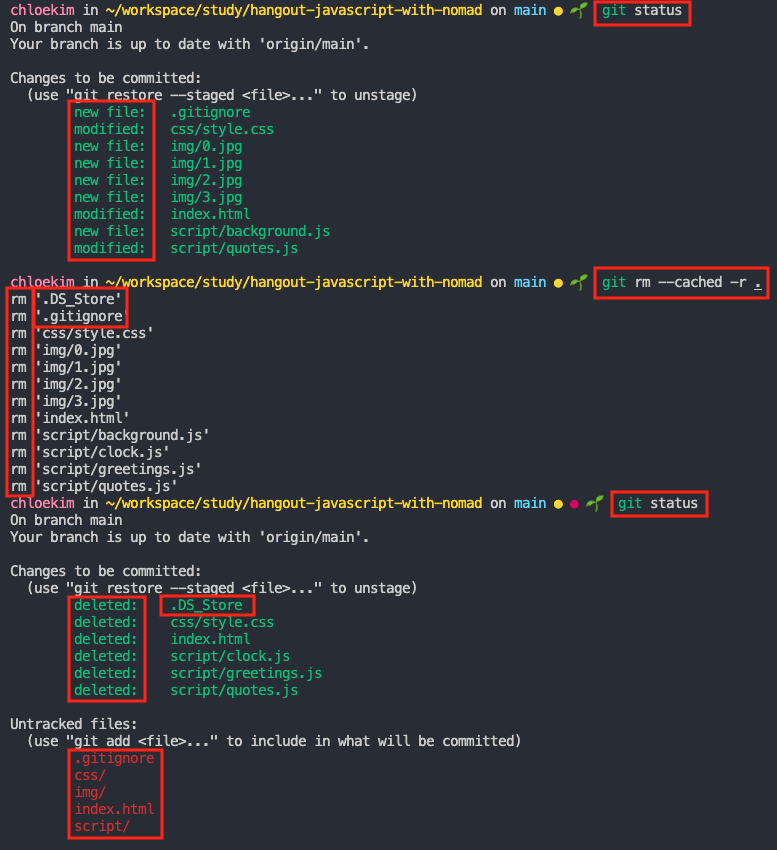
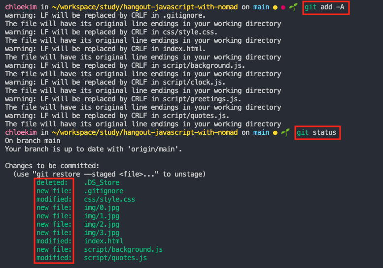

# hangout-javascript-with-nomad

[바닐라 JS로 크롬 앱 만들기](https://nomadcoders.co/javascript-for-beginners)로 따라한 과정

## 수료증

[](https://nomadcoders.co/certs/f9eba897-398e-4fbb-be9b-41f4713e7d1f)

## troubleshooting

### `.DS_Store` 추적 제거하기

> ~~Desktop Services Store의 약자로 애플에서 정의한 파일 포맷~~  
> 이지만 나에겐 git으로 관리할 필요가 없다.

1. [`.gitignore`](.gitignore) 파일 추가하기
2. [추적 제외 대상 추가하기](https://www.toptal.com/developers/gitignore/api/windows,macos,linux,visualstudiocode)
3. local git 엔진의 캐시 정보 갱신하기

   ```bash
   # check
   git status

   # at the root of repository
   git rm --cached -r .

   # check
   git status
   ```

   

   ```bash
   # tracking on stage
   git add -A

   # check
   git status
   ```

   

4. [결과](https://github.com/dev-chloe/hangout-javascript-with-nomad/commit/9d5311177532d6450c05ea93120111eea1a0ebcb#diff-e2eb93a61ffd7877ea5c751abcb3a618e8e2e9a2073a27f66d4114fe10819f86)
